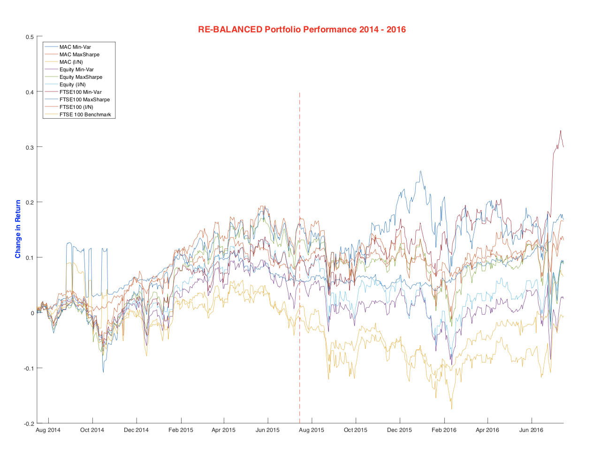

Introduction
-----

Modern Portfolio Theory finds application in most areas which requires optimizing objectives based on mean-variance analysis. It is extensively studied theory in areas of mathematics, statistics, and computational finance. It was the first of its kind to quantitatively address the trade-off between risk and reward in assessing portfolios.

